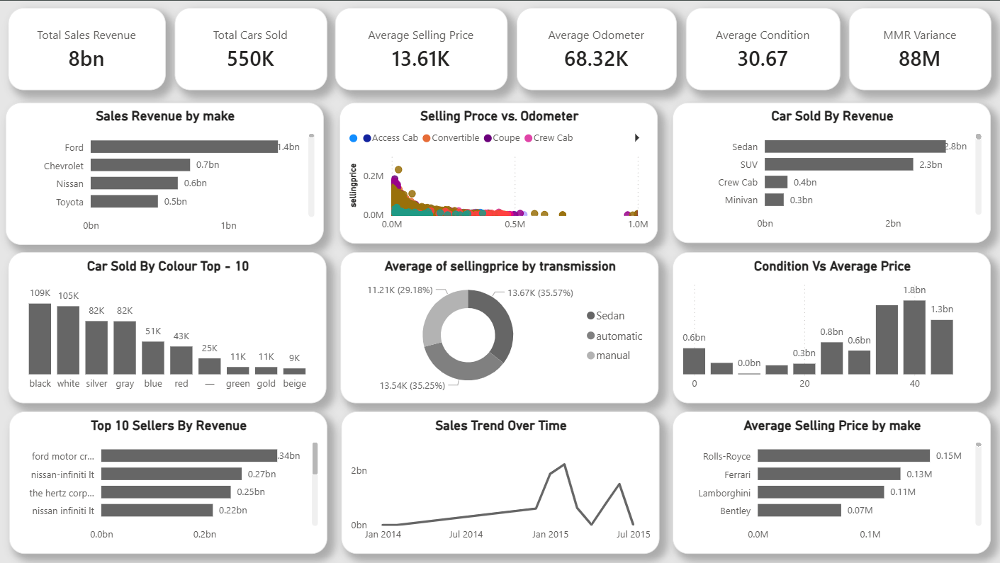

# 🚗 Car Sales & Market Trends Dashboard (Power BI)

Cars don’t have “one price” — the market decides it.

This project is a **Power BI dashboard** built using a **Vehicle Sales & Market Trends** dataset to understand what drives **selling price** and **sales revenue** across thousands of transactions (make, model, body type, transmission, condition, odometer, seller, MMR, sale date, etc.).

📌 Dashboard Preview

## 🧩 Context
Pricing in the used-car market depends on multiple factors—**mileage, condition, vehicle type, brand, transmission, seller behavior, and market timing**.  
The challenge is turning messy transaction data into a clear view of:
- what’s driving revenue,
- what’s impacting selling price,
- and where pricing differs from market reference values (MMR).

## 🎯 Objective
Build a dashboard that helps answer:
- Which **makes** and **sellers** drive the most revenue?
- How strongly does **odometer (mileage)** affect selling price?
- Does **transmission type** impact average selling price?
- How does **vehicle condition** relate to pricing?
- What trends appear over time (market movement/seasonality)?
- Where are there gaps between **MMR vs actual selling price**?

## ✅ What I Built
A single-page, KPI-first dashboard covering:

### Key KPIs
- Total Sales Revenue  
- Total Cars Sold  
- Average Selling Price  
- Average Odometer  
- Average Condition  
- MMR Variance (MMR vs Selling Price)

### Analysis Views
- **Sales Revenue by Make** (brand contribution)
- **Top Sellers by Revenue** (seller ranking)
- **Selling Price vs Odometer** (mileage impact + outliers)
- **Cars Sold / Revenue by Body Type** (segment dominance)
- **Average Selling Price by Transmission** (automatic vs manual)
- **Condition vs Average Price** (quality-to-price relationship)
- **Top 10 Colors Sold** (volume preference)
- **Sales Trend Over Time** (market movement)

 ## 🔧 How I Did It
1. Loaded and structured the dataset in **Power BI**
2. Cleaned and prepared key columns (dates, numeric fields, currency)
3. Created multiple **DAX measures** for:
   - Total revenue, total cars sold
   - Averages (selling price, odometer, condition)
   - **MMR variance** and comparative metrics
   - Time-based trend calculations
4. Used **Group/Bins** to bucket vehicle condition
   - Improved readability and made pricing insights easier to interpret
5. Designed a clean layout focused on decision-making
   - KPI cards first, then driver analysis (make/seller), then price drivers (mileage/condition/transmission), then trend views

## 📈 Impact / Insights Enabled
This dashboard makes it easy to:
- Identify the **top revenue-driving makes** and **top sellers**
- Quantify how mileage impacts selling price (and spot pricing outliers)
- Compare pricing patterns by **transmission type**
- See how higher condition levels correlate with higher average prices
- Track market movement over time to understand trend shifts
- Detect where selling prices deviate from **MMR** (potential over/under-pricing)

## 🧠 Skills Used
- Power BI (dashboard design + modeling)
- DAX (KPIs, averages, variance, trend measures)
- Data grouping/binning (condition buckets)
- Analytical thinking (pricing + market drivers)
- Data storytelling (clean, decision-focused layout)
